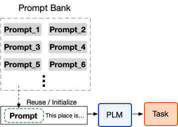
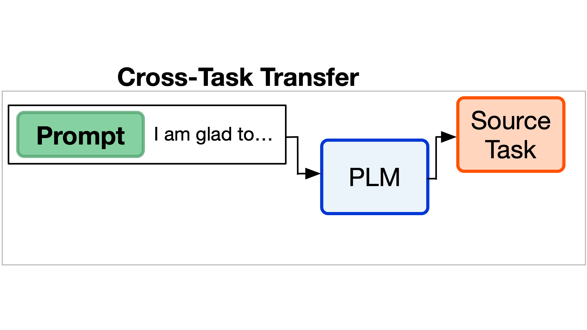
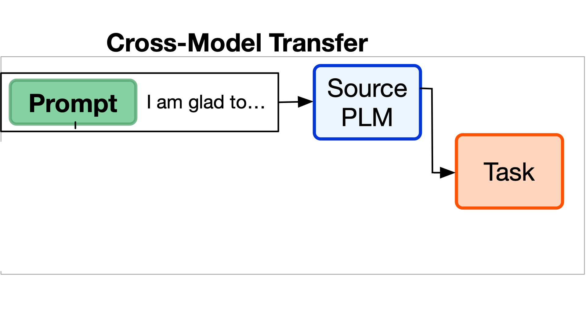
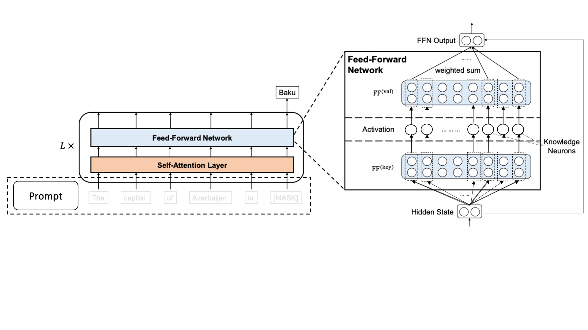

# On Transferability of Prompt Tuning for Natural Language Processing (Prompt Transferability)
[](https://img.shields.io/badge/Version-v0.1.0-blue)
[](https://opensource.org/licenses/MIT)
[](https://aclanthology.org/2022.naacl-main.290)
[](https://github.com/thunlp/Prompt-Transferability/stargazers)
[](https://colab.research.google.com/drive/1xUe9rLc2K9EbFAX9iDO1x9j9ZRKoUeO-?usp=sharing)
<!--[](https://colab.research.google.com/drive/1VCSIDaX_pgkrSjzouaNH14D8Fo7G9GBz?usp=sharing)-->


This is the source code of "On Transferability of Prompt Tuning for Natural Language Processing", an [NAACL 2022](https://2022.naacl.org/) paper [[**pdf**]](https://aclanthology.org/2022.naacl-main.290/).

## Overview



Prompt tuning (PT) is a promising parameter-efficient method to utilize extremely large pre-trained language models (PLMs), which can achieve comparable performance to full-parameter fine-tuning by only tuning a few soft prompts. However, PT requires much more training time than fine-tuning. Intuitively, knowledge transfer can help to improve the efficiency. To explore whether we can improve PT via prompt transfer, we empirically investigate the transferability of soft prompts across different downstream tasks and PLMs in this work. We find that (1) in zero-shot setting, trained soft prompts can effectively transfer to similar tasks on the same PLM and also to other PLMs with a cross-model projector trained on similar tasks; (2) when used as initialization, trained soft prompts of similar tasks and projected prompts of other PLMs can significantly accelerate training and also improve the performance of PT. Moreover, to explore what decides prompt transferability, we investigate various transferability indicators and find that the overlapping rate of activated neurons strongly reflects the transferability, which suggests how the prompts stimulate PLMs is essential. Our findings show that prompt transfer is promising for improving PT, and further research shall focus more on prompts' stimulation to PLMs.

#### Setups
* pip>=21.3.1
* python>=3.6
* torch>=1.9.0

We recommend using conda to manage the required packages. Create a new environment for Prompt Transferability.
```bash
conda create -n prompt_transfer python=3.8
```

Activate the environment and install required packages.

```bash
conda activate prompt_transfer
pip install -r requirements.txt
```

## Reproduce results in the paper

Please refer to [Prompt-Transferability-1.0](./Prompt-Transferability-1.0/) for more details about reproducing the results in the paper.


## Usage

You can easily use PromptHub for various perposes, including prompt training, evaluation, cross-task transfer, cross-model transfer, and activated neuron. The [Colab notebook](https://colab.research.google.com/drive/1xUe9rLc2K9EbFAX9iDO1x9j9ZRKoUeO-?usp=sharing) and the [example script](./Prompt-Transferability-2.0-latest/example/test.py) also demonstrate the usages. 

#### Quick Example
The following code shows an example of prompt training, evaluation, activated neuron analysis on `SST2` with `Roberta-base`

```python
from prompt_hub.hub import PromptHub
from prompt_hub.training_args import PromptTrainingArguments

# Training config
args = PromptTrainingArguments(
  output_dir='outputs', 
  dataset='sst2', 
  backbone='roberta-base', 
  learning_rate=1e-2
)
trainer = PromptHub(args=args)

# Prompt training and evaluation
trainer.train_prompt()
trainer.eval_prompt()

# Cross-task evaluation
cross_task_eval_results = trainer.cross_task_eval('roberta-base', 'sst2', 'rotten_tomatoes')


# Activated neuron
activated_neuron_before_relu, activated_neuron_after_relu = trainer.activated_neuron(args.backbone, args.dataset)

```

Or, you can run the bash file to run a quick example
```bash
bash example/train.sh
```


## Detailed Usage


#### Step 1: initialization of arguments and trainer
We first need to define a set of arguments or configurations, including what backbone model you want to use, which dataset to train on, how many soft prompt tokens do you want to use, etc. Then we instantiate a `PromptHub` object passing in the arguments we just created.

```python
from prompt_hub.training_args import PromptTrainingArguments

args = PromptTrainingArguments(
  output_dir='outputs',
  backbone='roberta-base',
  dataset='sst2',
  prompt_len=100
)
trainer = PromptHub(args=args)
```

For a complete list of arguments, please refer to `prompt_hub/training_args.py` and HuggingFace `transformers.training_arguments` for more details. 

#### Step 2: prompt training
Then we can start training a soft prompt. (_Optional_)You can pass in parameters to overwrite the default configurations in the arguments you passed in. We support `Bert`, `Roberta`, `GPT`, and `T5 v1.1`.

```python
trainer.train_prompt() 
# trainer.train_prompt('roberta-large', 'sst2') # Optional arguments to overwrite default parameters
```

#### Step 3: prompt evaluation
With the trained prompt, we can evaluate its performance. You can overwrite the default configs as above.

```python
eval_results = trainer.eval_prompt()
# eval_results = trainer.eval_prompt('roberta-base', 'sst2') # Optional arguments to overwrite default parameters
```


## Cross-Task Transfer

We can directly utilize any wel-trained prompts on a specific models.

For example, we transfer the prompt trained on `SST2` to `Rotten Tomatoes`.

```
cross_task_eval_results = trainer.cross_task_eval('roberta-base', 'sst2', 'rotten_tomatoes')
```

## Cross-Model Transfer

Unlike cross-task transfer, cross-model require utilize a projector to transfer the prompt.

#### Step 1: cross-model Training
We first train a projector (from `roberta-base` to `roberta-large` on `SST2` dataset).

```python
trainer.cross_model_train(source_model='roberta-base', target_model='roberta-large', task='sst2')
```

#### Step 2: cross-model evaluation
Then, we utilize it to transfer the prompt to another models. 

```python
cross_model_eval_results = trainer.cross_model_eval(source_model='roberta-base', target_model='roberta-large', task='sst2')
```


## Transferability Indicators (Activated neuron)

Prompt can be seen as a paradigm to manipulate PLMs (stimulate artificial neurons) to perform downstream tasks. We further observe that similar prompts will activate similar neurons; thus, it can be a transferability indicator.

Definition of Neurons: the output values between 1st and 2nd layers of feed-forward network FFN (in every layer of a PLM) [Refer to Section 6.1 in the paper]

#### Step 1: Acquire task-specific neurons
Given a model and the trained task-specific prompt, you can obtain the activated neurons values.

```python
activated_neuron_before_relu, activated_neuron_after_relu = trainer.activated_neuron('roberta-base', 'sst2')
```

#### Step 2: Similarity/Transferability between two tasks
You can caculate the similarity/transferability between two tasks via actiaved neurons.
```python
cos_sim = trainer.neuron_similarity(backbone='roberta-base', task1='sst2', task2='rotten_tomatoes')
```

#### Step 3: Masked Neurons
To further demonstrate the importance of task-specific neurons, we mask them and find the model performance on the corresponding task will degrade. Visualization of activated neurons is also supported.

```
eval_metric, mask = trainer.mask_activated_neuron(args.backbone, args.dataset, ratio=0.2)
trainer.plot_neuron()
```

<!--[](https://colab.research.google.com/drive/1VCSIDaX_pgkrSjzouaNH14D8Fo7G9GBz?usp=sharing)-->

## Citations
[](https://aclanthology.org/2022.naacl-main.290)

Please cite our paper if it is helpful to your work!

```bibtex
@inproceedings{su-etal-2022-transferability,
    title = "On Transferability of Prompt Tuning for Natural Language Processing",
    author = "Su, Yusheng  and
      Wang, Xiaozhi  and
      Qin, Yujia  and
      Chan, Chi-Min  and
      Lin, Yankai  and
      Wang, Huadong  and
      Wen, Kaiyue  and
      Liu, Zhiyuan  and
      Li, Peng  and
      Li, Juanzi  and
      Hou, Lei  and
      Sun, Maosong  and
      Zhou, Jie",
    booktitle = "Proceedings of the 2022 Conference of the North American Chapter of the Association for Computational Linguistics: Human Language Technologies",
    month = jul,
    year = "2022",
    address = "Seattle, United States",
    publisher = "Association for Computational Linguistics",
    url = "https://aclanthology.org/2022.naacl-main.290",
    doi = "10.18653/v1/2022.naacl-main.290",
    pages = "3949--3969"
}
```

## Contact
[Yusheng Su](https://yushengsu-thu.github.io/)

Mail: yushengsu.thu@gmail.com; suys19@mauls.tsinghua.edu.cn
