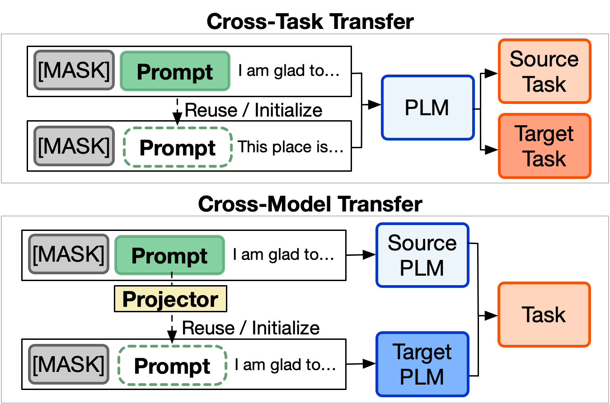

# On Transferability of Prompt Tuning for Natural Language Processing

[](https://img.shields.io/badge/Version-v0.1.0-blue)
[](https://opensource.org/licenses/MIT)
[](https://arxiv.org/abs/2111.06719)
[](https://github.com/thunlp/Prompt-Transferability/stargazers)

- [**NAACL 2022**](https://2022.naacl.org/) Accepted. [[**pdf**]](https://arxiv.org/abs/2111.06719)

## Overview


Prompt tuning (PT) is a promising parameter-efficient method to utilize extremely large pre-trained language models (PLMs), which can achieve comparable performance to full-parameter fine-tuning by only tuning a few soft prompts. However, PT requires much more training time than fine-tuning. Intuitively, knowledge transfer can help to improve the efficiency. To explore whether we can improve PT via prompt transfer, we empirically investigate the transferability of soft prompts across different downstream tasks and PLMs in this work. We find that (1) in zero-shot setting, trained soft prompts can effectively transfer to similar tasks on the same PLM and also to other PLMs with a cross-model projector trained on similar tasks; (2) when used as initialization, trained soft prompts of similar tasks and projected prompts of other PLMs can significantly accelerate training and also improve the performance of PT. Moreover, to explore what decides prompt transferability, we investigate various transferability indicators and find that the overlapping rate of activated neurons strongly reflects the transferability, which suggests how the prompts stimulate PLMs is essential. Our findings show that prompt transfer is promising for improving PT, and further research shall focus more on prompts' stimulation to PLMs.

### Setups
* pip>=21.3.1
* python>=3.6.13
* torch==1.9.0+cu111

You could refer `environment.yml` for more details.


### Requirements
```
bash requirement.sh
```

### Download PLM Checkpoints from Huggieface
You could directly download PLMs (Checkpoints and Tokenizers) to the corresponding directories as below:
> Bert: `bert-base-uncased`
```
mkdir BertForMaskedLM
```
> Roberta: `roberta-base`, `roberta-large`
```
mkdir RobertaForMaskedLM
mkdir RobertaLargeForMaskedLM
```
> T5: `t5-small`, `t5-base`, `t5-large`
```
mkdir T5SmallForMaskedLM
mkdir T5ForMaskedLM
mkdir T5LargeForMaskedLM
```

### Download Downstream Dataset
```
Refer to data/download_dataset_convert_file.py
```


## Train (Prompt Tuning)
Perform Prompt Tuning: 
```
bash train.sh
```

Example:
```
gpus=0
DATASET="SST2"
BACKBONE="Roberta"

CUDA_VISIBLE_DEVICES=$gpus python3 train.py --config config/${DATASET}Prompt${BACKBONE}.config \
    --gpu $gpus \
    --checkpoint model/${DATASET}Prompt${BACKBONE} \
```

Main Arguments:
* `--config`: Prompt Tuning (PT) / Validation configurations in `/config` directory.
* `--gpu`: Assign gpu ID.
* `--checkpoint`: Initialize prompt parameters for Prompt Tuning (PT).

After prompt tuning, you could use `copy_prompt_to_taskpromptdir.py` to convert trained prompts and save them as tensors in `/task_prompt_emb`.


## Evaluate (Trained Prompts)
Evaluate trained prompts on the corresponding tasks:
```
bash valid.sh
```

Example:
```
gpus=0
DATASET="SST2"
BACKBONE="Roberta"

CUDA_VISIBLE_DEVICES=$gpus python3 valid.py --config config/{DATASET}Prompt${BACKBONE}.config \
    --gpu $gpus \
    --checkpoint model/${DATASET}Prompt${BACKBONE} \
```
Main Arguments:
* `--config`: Utilize the same configurations as PT.
* `--gpu`: Assign gpu ID.
* `--checkpoint`: Trained prompts for validation.


## Cross-task Transfer
Perform cross-task transfer experiments: 
```
bash valid_cross_task.sh
```

Example:
```
gpus=0
BASEMODEL="T5Large"
DATASET=IMDBPrompt 
PROMPT=laptopPrompt 

echo "==========================="
echo Model: config/${DATASET}${BASEMODEL}.config
echo Prompt-emb: task_prompt_emb/${PROMPT}${BASEMODEL}
echo "==========================="

CUDA_VISIBLE_DEVICES=$gpus python3 valid.py --config config/${DATASET}${BASEMODEL}.config \
    --gpu $gpus \
    --checkpoint model/${DATASET}${BASEMODEL} \
    --replacing_prompt task_prompt_emb/${PROMPT}${BASEMODEL}
```

Main Arguments:
* `--config`: Utilize the same configurations as PT.
* `--gpu`: Assign gpu ID.
* `--replacing_prompt`: Choose the source trained prompts to transfer to another tasks.


## Cross-model Transfer (Train)
Train projectors for cross-model transfer:
```
bash train_cross_model.sh
```

Example:
```
DATASET="laptop"
MODEL_PROMPT="T5-base"
SOURCE_MODEL="T5"
TARGET_MODEL="Roberta"
source_model="t5"
target_model="roberta"

CUDA_VISIBLE_DEVICES=$gpus python3 train_cross.py --config config/crossPrompt${TARGET_MODEL}_${DATASET}_100_${source_model}_to_${target_model}.config \
    --gpu $gpus \
    --model_prompt $MODEL_PROMPT
```

Main Arguments:
* `--config`: Configurations for cross-model projectors.
* `--gpu`: Assign gpu ID.
* `--model_prompt`: Trained prompts for training cross-model projectors.


## Transferability Indicators (Neuron Stimulation)
Capture values of neurons (the output values between 1st and 2nd layers of feed-forward network FFN) in every layer of a PLM [Refer to Section 6.1 in the paper]:
```
bash activate_neuron.sh
```

Example:
```
BACKBONE_MODEL="Roberta"

for MODEL in IMDBPrompt${BACKBONE_MODEL} laptopPrompt${BACKBONE_MODEL} MNLIPrompt${BACKBONE_MODEL} QNLIPrompt${BACKBONE_MODEL} QQPPrompt${BACKBONE_MODEL} restaurantPrompt${BACKBONE_MODEL} SST2Prompt${BACKBONE_MODEL} snliPrompt${BACKBONE_MODEL} tweetevalsentimentPrompt${BACKBONE_MODEL} movierationalesPrompt${BACKBONE_MODEL} recastnerPrompt${BACKBONE_MODEL} ethicsdeontologyPrompt${BACKBONE_MODEL} ethicsjusticePrompt${BACKBONE_MODEL} MRPCPrompt${BACKBONE_MODEL}
do
    echo "==========================="
    echo Activate_neuronPrompt${BACKBONE_MODEL}
    echo Stimulate neurons with task_prompt_emb/$MODEL
    echo "==========================="

    CUDA_VISIBLE_DEVICES=$gpus python3 activate_neuron_${BACKBONE_MODEL}.py --config config/activate_neuronPrompt${BACKBONE_MODEL}.config \
        --gpu $gpus \
        --replacing_prompt task_prompt_emb/$MODEL \
        --activate_neuron
done
```

Main Arguments:
* `--config`: Configurations for neuron stimulation (capture neuron values).
* `--gpu`: Assign gpu ID.
* `--replacing_prompt`: Choose trained prompts to stimulate neurons.
* `--activate_neuron`: Neuron-capture mode.


## Transferability Indicators (Different Metric Results)
Utilize different metrics to evaluate transferability indicators:
```
python3 caculate_metric_value_for_correlation.py
```


## Citations
[](https://arxiv.org/abs/2111.06719)

Please cite our paper if they are helpful to your work!

```bibtex
@inproceedings{su2021transferability,
   title={On Transferability of Prompt Tuning for Natural Language Processing},
   author={Su, Yusheng and Wang, Xiaozhi and Qin, Yujia and Chan, Chi-Min and Lin, Yankai and Wang, Huadong and Wen, Kaiyue and Liu, Zhiyuan and Li, Peng and Li, Juanzi and Hou, Lei and Sun, Maosong and Zhou, Jie},
   booktitle={Annual Conference of the North American Chapter of the Association for Computational Linguistics (NAACL)},
   year={2022},
   doi = {10.48550/ARXIV.2111.06719},
   url = {https://arxiv.org/abs/2111.06719}
}
```

## Contact
[Yusheng Su](https://yushengsu-thu.github.io/)

Mail: yushengsu.thu@gmail.com; suys19@mauls.tsinghua.edu.cn
